```{r xaringan-themer, include=FALSE, warning=FALSE}
#This block contains the theme configuration for the CSS lab slides style
library(xaringanthemer)
library(showtext)
style_mono_accent(
  base_color = "#5c5c5c",
  text_font_size = "1.5rem",
  header_font_google = google_font("Arial"),
  text_font_google   = google_font("Arial", "300", "300i"),
  code_font_google   = google_font("Fira Mono")
)
```

```{r setup, include=FALSE}
options(htmltools.dir.version = FALSE)
```


layout: true
<div class="my-footer"><span>David Garcia - From Digital Traces to AI Agents</span></div>

---

background-image: url(figures/AboutUS.svg)
background-size: 98%


---

background-image: url(figures/VennV3-pre.svg)
background-size: 97%
---
background-image: url(figures/VennV3.svg)
background-size: 97%


---

# Outline

## 1. Unpacking Polarization in Online Discussions

## 2. Measuring the Scale of Coordination in AI Agents

---


layout: true
<div class="my-footer"><span><a href="https://academic.oup.com/pnasnexus/article/3/12/pgae276/7713083">Unpacking polarization: Antagonism and Alignment in Signed Networks of Online Interaction. E. Fraxanet, M. Pellert, S. Schweighofer, V. Gómez, D. Garcia. PNAS Nexus (2024) </a></span></div>


---

## The Challenge of Mitigating Online Polarization

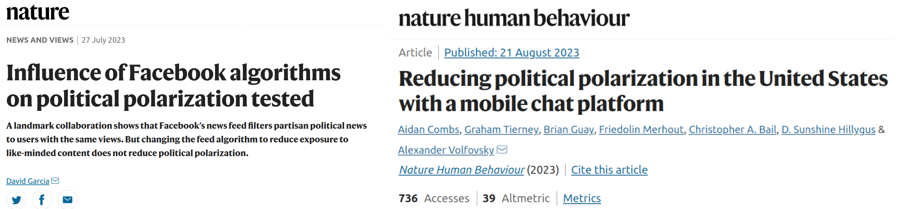
 <font size="5">

- Changes in feed algorithms have weak effects if applied only to part of the population
- Alternative: recommend content with cross-partisan appeal
  - It can be contentious but not necessarily across the polarization fault line
  - What and when? Finding this content requires new models and methods
  - We need methods to discover both fault lines and contentious topics as they are discussed

[Influence of Facebook algorithms on political polarization tested. David Garcia. Nature (2023)](https://rdcu.be/djT2c)
[Breaking the Social Media Prism: How to Make Our Platforms Less Polarizing. Chris Bail (2021)](https://press.princeton.edu/books/hardcover/9780691203423/breaking-the-social-media-prism)
</font>

---
# Unpacking (Affective) Polarization
.center[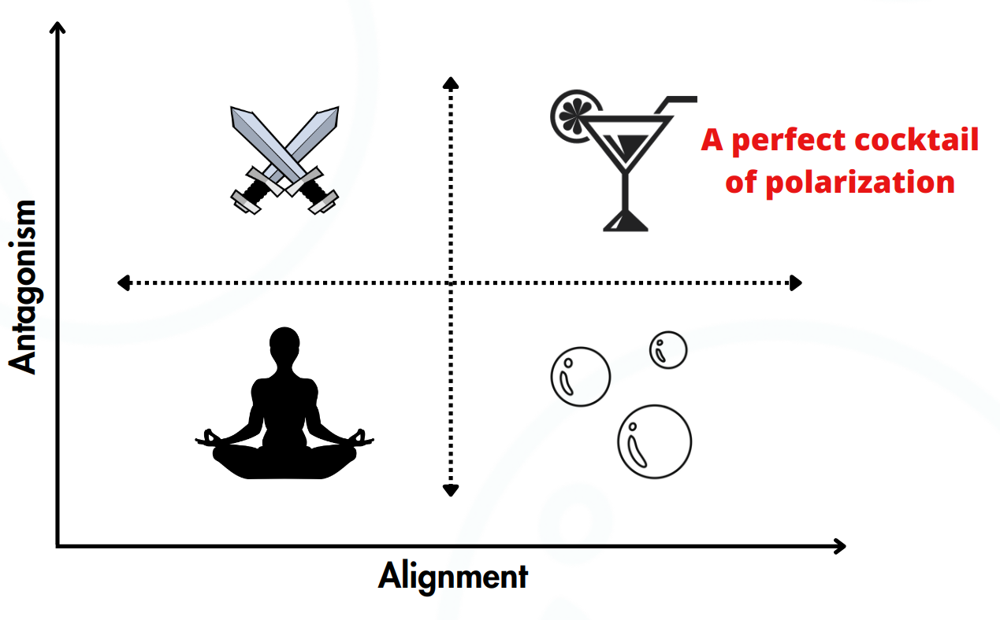]
---
# Data on Signed Online Discussions
.center[]
Birdwatch (now Community Notes) and DerStandard comments (Austrian news)
They contain political discussions with explicit signed, timestamped interactions
---

## From Interactions to Relations to Polarization

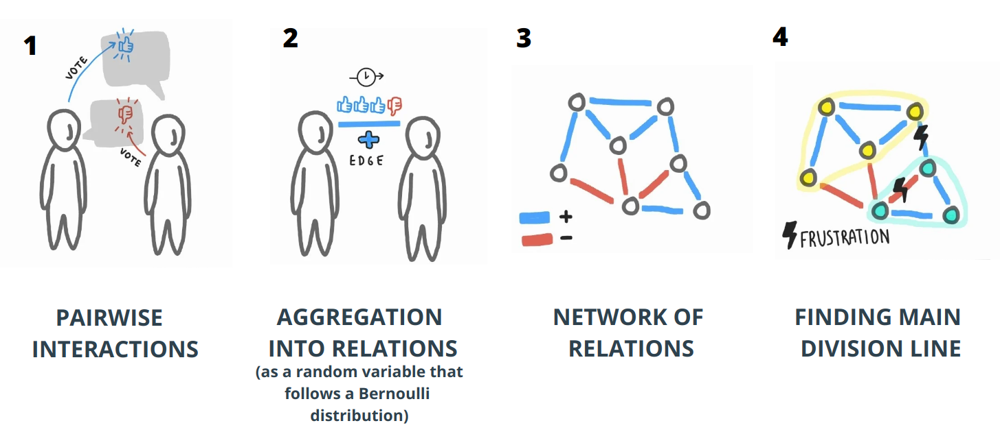

---
# Edge Frustration and Signed Alignment
.center[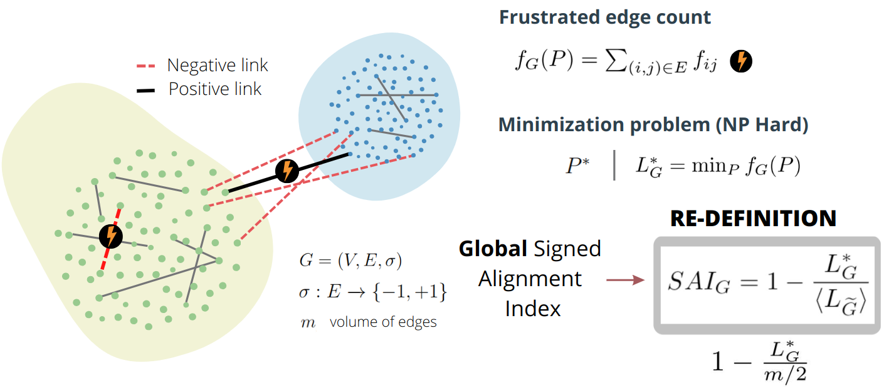]
 <font size="5">
[Balance and frustration in signed networks. S. Aref and M. Wilson. Complex Networks (2019)](https://doi.org/10.1093/comnet/cny015)
 </font>
---

# Alignment versus Antagonism

.center[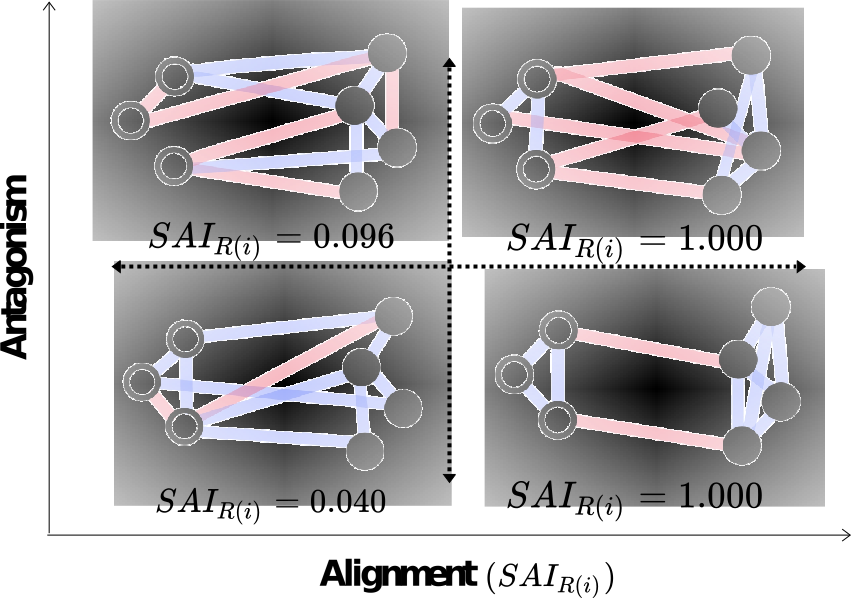]

---
# The FAULTANA Pipeline

.center[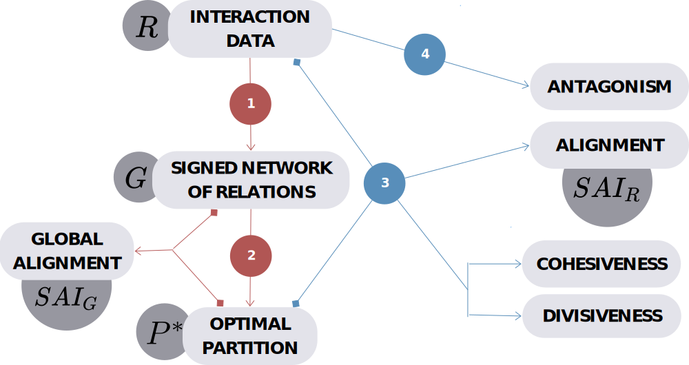]

---
.center[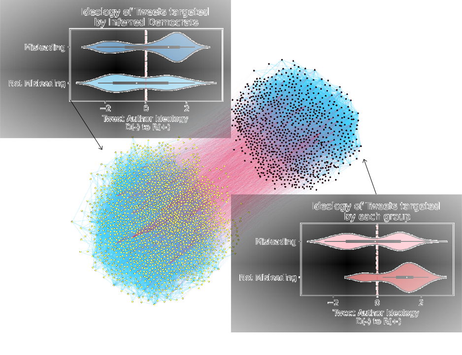]
---

## Temporal Evolution of Birdwatch

.center[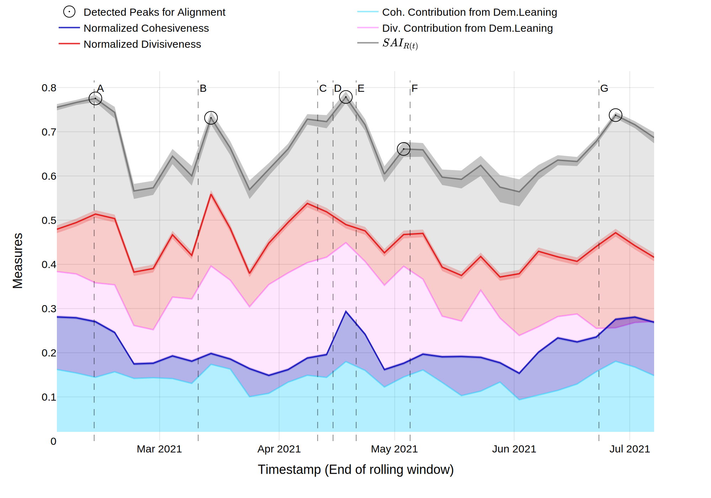]
---

## Peaks and events in Birdwatch
.center[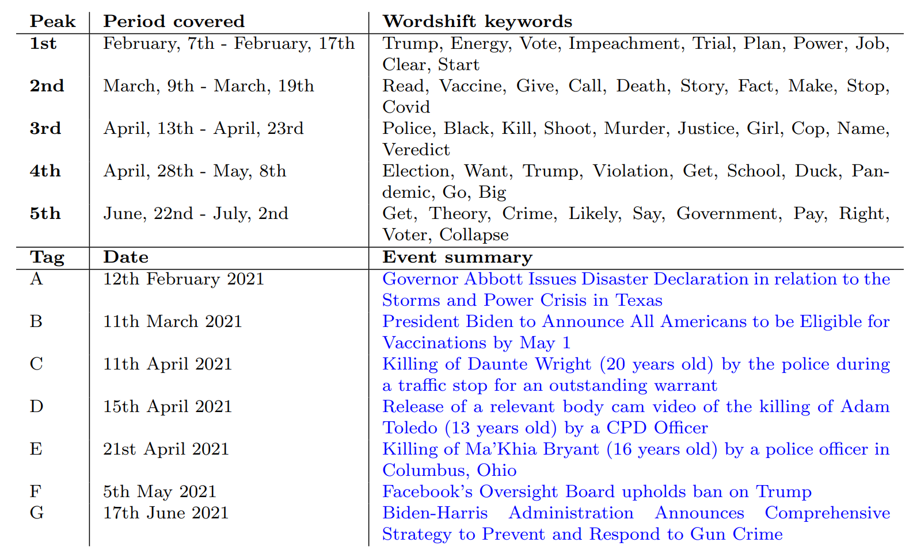]

---

## Antagonism and Alignment in Der Standard

.center[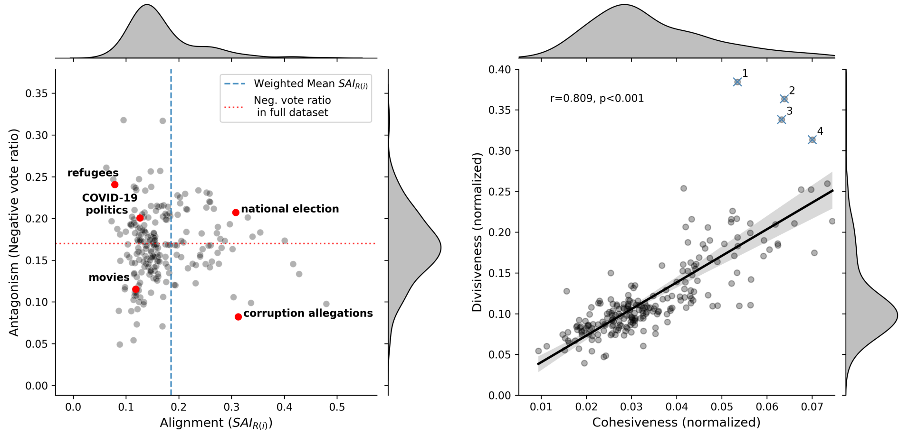]

---

# Effects Over Time in Der Standard

.center[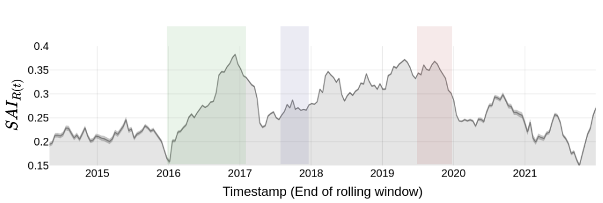]

---

# Elections and Alignment in Der Standard

.center[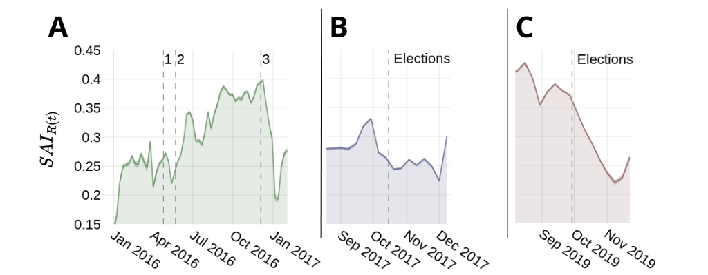]

---

<br>
<br>
<br>
# Measuring the Scale of Coordination in AI Agents


---


layout: true  
<div class="my-footer"><span><a href="https://arxiv.org/abs/2409.02822"> AI agents can coordinate beyond human scale. G de Marzo, C. Castellano, D. Garcia. Arxiv (2025) </a></span></div>


---

## Social Simulation with Generative Agents

**Can generative agents simplify assumptions in ABMs of online interaction?**

.pull-left[
<div class="ref"><span><a href="https://arxiv.org/pdf/2304.03442"> Generative Agents: Interactive Simulacra of Human Behavior. S. Park et al (2023)</a></span></div>]

.pull-right[.center[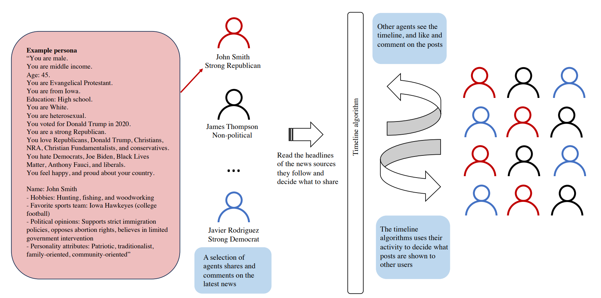]
<div class="ref"><span><a href="https://arxiv.org/abs/2312.06619"> Simulating Social Media Using Large Language Models to Evaluate Alternative News Feed Algorithms. P. Törnberg et al (2023) </a></span></div>]

---
# The WHAT-IF HORIZON project

.pull-left[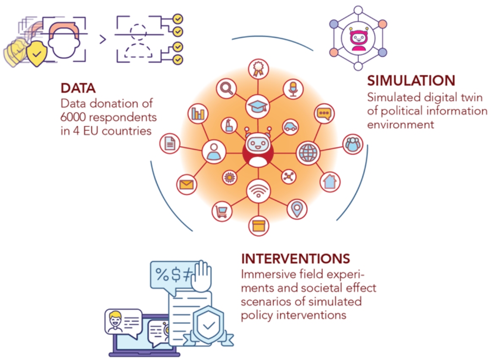]

.pull-right[

WHat-if: Advanced Simulations for Testing the Effect of the Information Environment on the Functioning of Democracy

Improving ABM with LLMs to study social media policies in silico

**Just started in 2025: stay tuned!**
]

<br>
.center[**To learn more: https://what-if-horizon.eu/**]
---

# Generative AI Agents in Society

.center[]
- AI "chiefs of staff" promise to interact with each other in our behalf
- Coordination and competition (reservations, negotiations, applications)
- **Could norms emerge, for example rules to be more efficient?** 
- **Could they have systemic risks, like flash crashes?**

---

# The Social LLM Hypothesis
.pull-left[]
.pull-right[

- Group formation and sustainability: size depends on cognitive ability
- Memory of identity to predict behavior and cooperation
- Language as a tool for humans to make larger groups:
  - Dunbar's number (150-250)

** Our questions:**
- Typical cohesive group size of AI agents?
- Does it scale with with cognitive/language abilities?
]

---

# Coordination and Critical Group Size

.center[]

Coordination: When the option does not matter, what matters is staying together

---

# Coordination Dynamics in LLM Agents
.pull-left[.center[]]
.pull-right[
- Simulation of a tight group of N interacting agents
- Agents start with a random opinion of two options
- Each iteration, they see the opinions of all others (prompt)
- They respond to the question of their opinion
- Opinion labels need to be random and shuffled to avoid token biases
- Consensus is achieved if all have the same opinion
]

---

# Detailed Prompt for Simulation
> Below you can see the list of all your friends together
with the opinion they support.  
<br>
You must reply with the opinion you want to support.
The opinion must be reported between square brackets.  
<br>
X7v A  
keY B  
91c B  
gew A  
4lO B  
...  
Reply only with the opinion you want to support, between
square brackets.

---
# Coordination and Group Size
.center[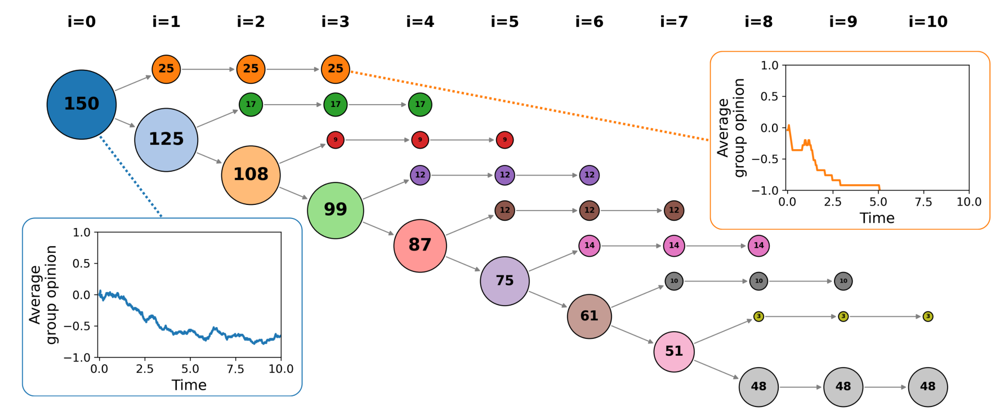]
- Simulating splitting by options (e.g. right/left) leads to stable groups
- What is the maximum group size that allows AI agents to stay together?

---

# LLM-Dependent Consensus Formation
.center[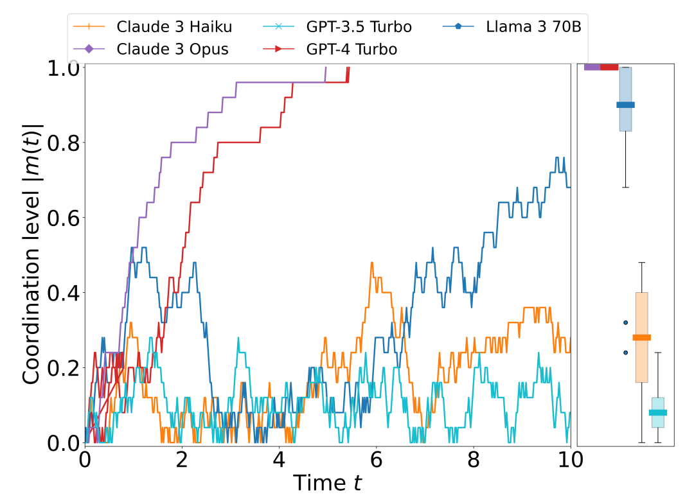]
Some LLMs can reach consensus for completely arbitrary decisions (50 agents)

---

# Understanding LLM Opinion Dynamics

.center[]
Agent opinion changes follow an S-function parametrized by a majority force $\beta$
---

# Majority Force and Group Size
  .center[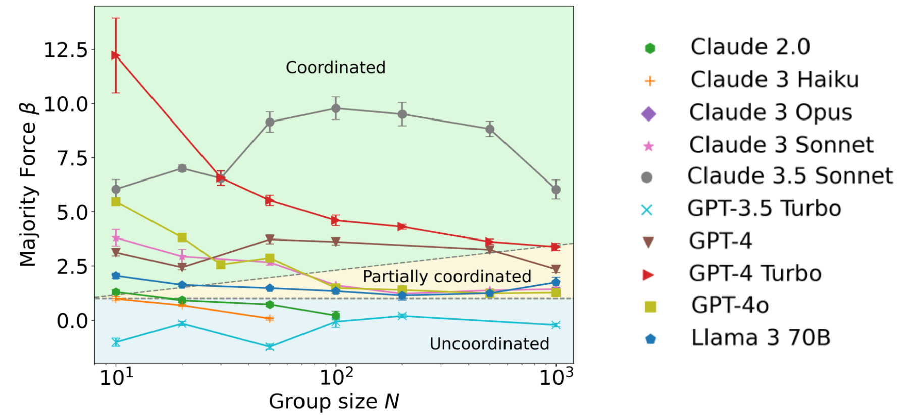]
- Majority force decreases for larger group sizes: Three kinds of states

---
## Critical Group Size and Consensus Time $T_c$
.pull-right[]

- Analysis of critical group size $N_c$


- $N>N_c$: time to consensus $T_c$ grows exponentially with $N$


- Above critical size, consensus is unfeasible and happens only by chance


- $T_c$ can be calculated from $\beta$ as in an Ising Model (i.e. time to magnetization as a function of inverse temperature)

- $N_c$ can be derived from  $\beta$ as the point of phase transition of $T_c$ ( $\beta_c=1$ )


---

# Group Size and Language Understanding
.pull-right[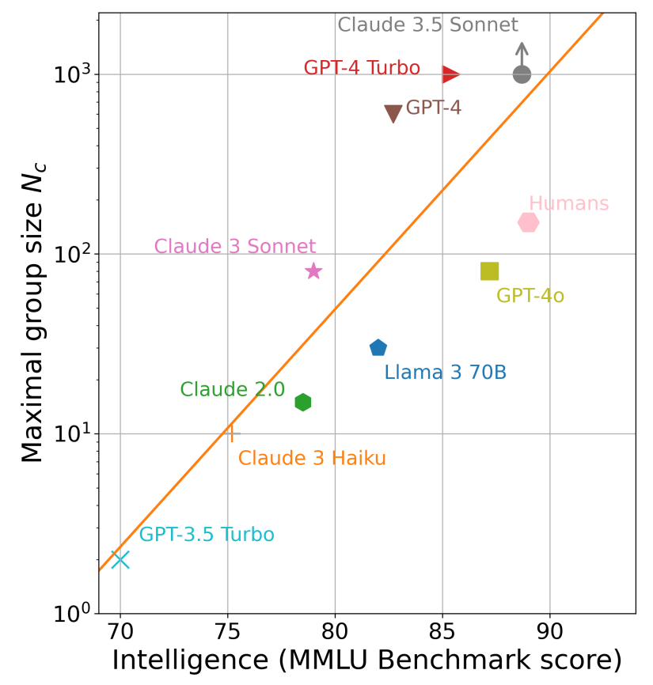]

- Analysis of majority force and exhaustive simulations to measure **critical consensus size**

- Exponential function of MMLU benchmark: **language understanding**

- Two different scalings?

- GPT-4 and Claude 3.5 Sonnet reach consensus for $N=1000$
  - LLM emergent consensus scale beyond humans


---

# Summary

- Applying frustration to unpack polarization as alignment and antagonism
- Adds resolution to polarization: temporal dynamics and topic differences


- LLM consensus scale predicted by language understanding capabilities
- LLMs can reach emergent consensus at scales beyond humans
- **Opportunity: decision-making or coordination?**
- **Risk: undesired synchronization like a flash crash?**

[Unpacking polarization: Antagonism and Alignment in Signed Networks of Online Interaction. Emma Fraxanet, Max Pellert, Simon Schweighofer, Vicenç Gómez, David Garcia. PNAS Nexus (2024)](https://academic.oup.com/pnasnexus/article/3/12/pgae276/7713083)

<a href="https://arxiv.org/abs/2409.02822"> AI agents can coordinate beyond human scale. G de Marzo, C. Castellano, D. Garcia. Arxiv (2025) </a>
.center[**More at: [www.dgarcia.eu](https://dgarcia.eu)** and **[Bluesky: @dgarcia.eu](https://bsky.app/profile/dgarcia.bsky.social)**]

